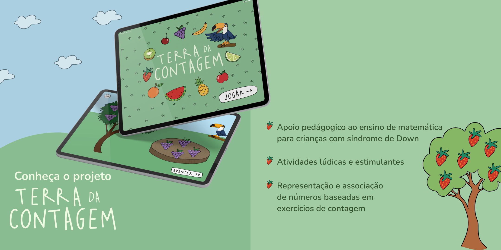
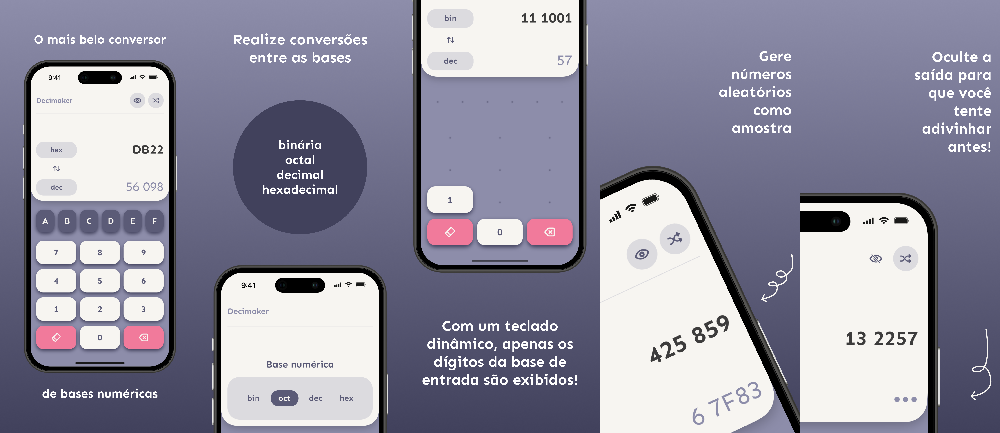

## 1. Terra da Contagem

Terra da Contagem é um aplicativo para iPad desenvolvido por estudantes da Apple Developer Academy PUC-Rio, em 2021, para o ensino da contagem dos números de 1 a 10 para crianças com síndrome de Down.

[Baixe o Terra da Contagem agora na App Store!](https://apps.apple.com/br/app/terra-da-contagem/id1592828397?l=en)

## 2. Decimaker

Decimaker é o mais belo conversor de bases numéricas, feito para iOS.

[Baixe o Decimaker agora na App Store!](https://apps.apple.com/br/app/decimaker/id6445917760?l=en)
